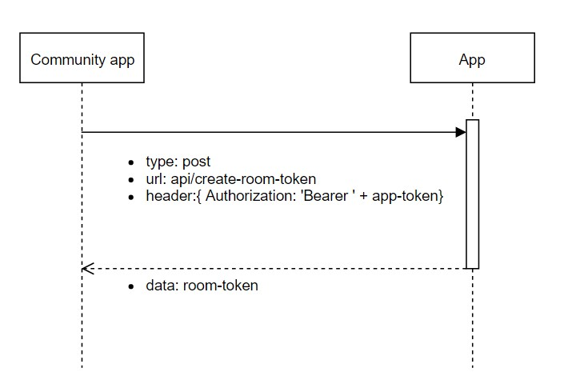
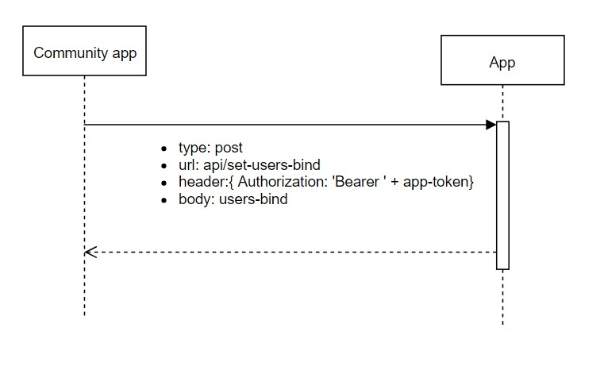
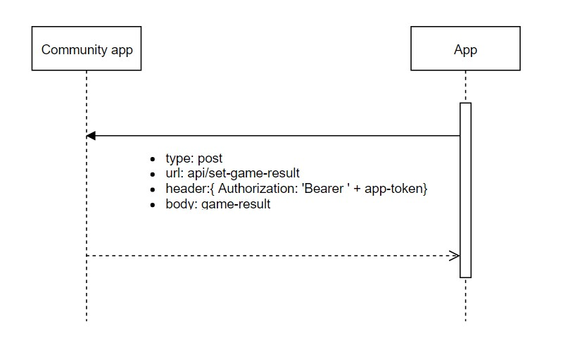

### Сожержание:

* [Регистрация](#Регистрация)
* [Поддержка запросов](#Поддержка-запросов)
* [Community-layer](#community-layer)
* [Контакты](#Контакты)

### Регистрация
Для регистрации своего приложения нужно перейти на панель администратора в Community App и ввести данные приложения. (Если панель администратора недоступна обратитесь к администратору).

После успешной регистрации приложения, выдаётся идентификационный токен. Токен требуется для идентификации приложения в системе и безопасности передачи данных.

### Поддержка запросов
При работе, Community app будет запрашивать у Приложения данные.

1.  Токен комнаты. Для создания комнаты Community App требуется уникальный токен комнаты. Для его получения Community App будет отправлять post запрос на url `api/create-room-token` вашего Приложения и ожидает токен комнаты (строка).



2.  Так же при соединении игрока к комнате для него создаётся уникальный токен и привязывается к токену комнаты. И перед перенаправлением игроков из комнаты ожидания в игру Community App отправляет эти данные в приложение. Community App будет отправлять post запрос на url `api/set-user-bind` вашего приложения с объектом `{ room: "ROOM_TOKEN"; players: ["FIRST_USER_TOKEN", "SECOND_USER_TOKEN"]; }`



3.  Community App ожидает от приложения запрос со статистическими данными. Что это post запрос на url `http://localhost:3030/api/set-game-result` community-app c массивом результатов игры пользователей комнаты.

      `[ { userToken: "USER_TOKEN"; playedTime: 100000; scores: 20; resultStatus: 1; participationStatus: 2; }]`

      Где 'resultStatus' результат игры пользователя: 1 - Пользователь проиграл, 2 - Пользователь выиграл, 3 - Ничья.
      А  'participationStatus' сотояние игрока на конец игры: 1 - Вышел до конца игра, 2 - Доиграл до конца. 


      
### Community-layer
Если у вас Node.js сервер вы можете использовать npm пакет community-layer
* Установка

    `npm i community-layer --save`
* Использование
```
const CommunityLayer = require('community-layer').CommunityLayer;

const ResultStatus = {
  INIT: 0,
  WIN: 1,
  LOSE: 2,
  DEAD_HEAT: 3,
}

const ParticipationStatus = {
  INIT: 0,
  LEAVE: 1,
  PLAY: 2
}

function sendStatistic() {
  const communityLayer = new CommunityLayer();

  const userStatistic = {
    userToken: "USER_TOKEN", 
    playedTime: 100000,
    scores: 20,
    resultStatus: ResultStatus.WIN, 
    participationStatus: ParticipationStatus.PLAY,
  }

    communityLayer.gameCycle.setGameResult(userStatistic, appToken);
}
```
### Контакты
Gmail: js.machine.team@gmail.com

Twitter: https://twitter.com/js_machine_team

Telegram: https://t.me/joinchat/Gv0AXxLi0Su2Jv4AhCaCkA
